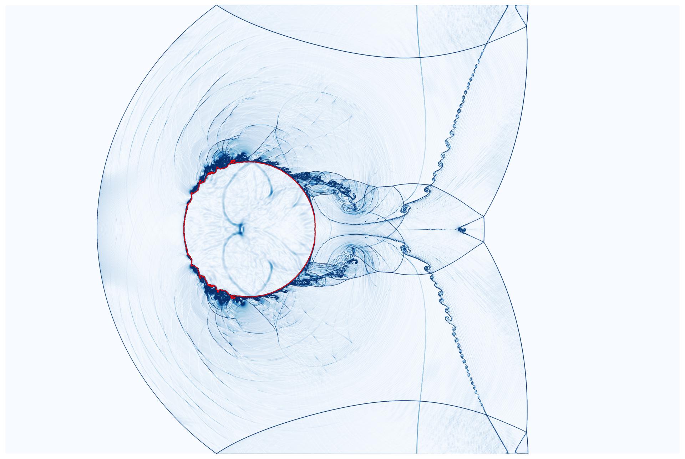
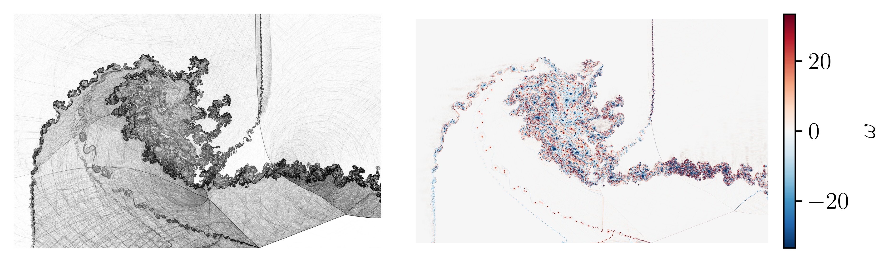
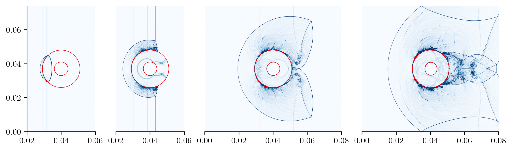
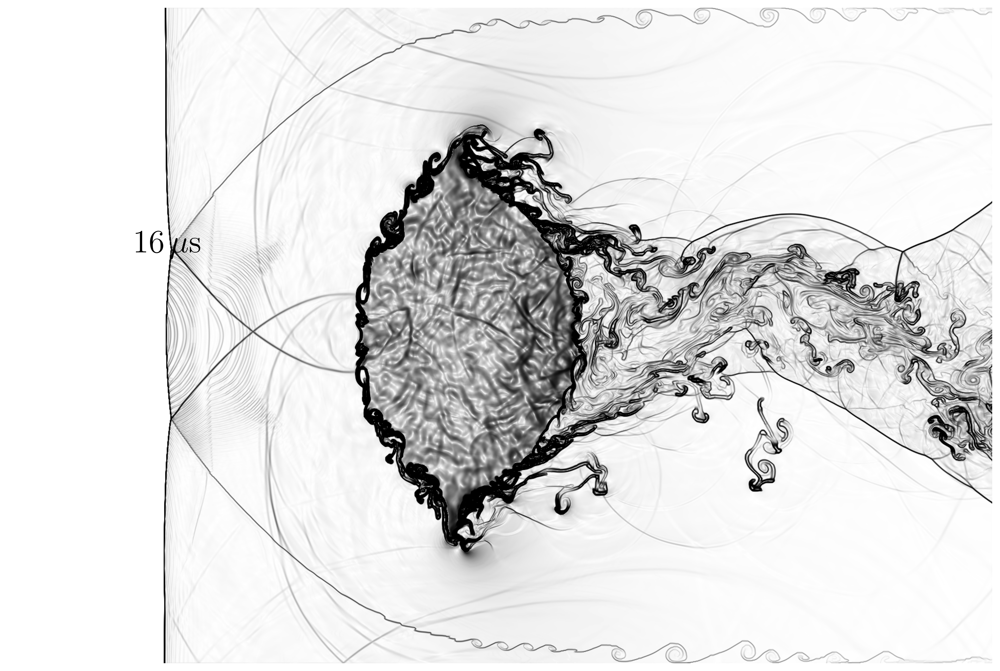

# WA-Warp: Wave-Appropriate reconstruction for multicomponent and multiphase flows

Multiphase solver implemented using [NVIDIA Warp](https://github.com/NVIDIA/warp) is based on the wave-appropriate reconstruction framework developed by Chamarthi et al. (2023–2026).


*Shock–water cylinder interaction.*

*Shock interaction with complex droplet shapes; Second droplet is also moving and collides with the other droplet.*



---

## Details

Before you begin using the code, please read the preprint titled “Wave-Appropriate Reconstruction of Compressible Multiphase and Multicomponent Flows: Fully Conservative and Semi-Conservative Eigenstructures” (2026), available on arXiv:2604.20036.

If you have reached this point, I recommend reading the following papers published in the Journal of Computational Physics:

- Karni (1994)
- Abgrall (1996)
- Abgrall and Karni (2001)
- Johnsen and Colonius (2003)
- Johnsen (2011)
- Hoffmann, Chamarthi and Frankel (2024)
- Chamarthi (2025)


## Code

There are two codes: sainath_SC_it_works.py and Sainath_M10.py. 

The first one goes beyond what I even considered in the arXiv:2604.20036 paper. It applies THINC for entropy waves and the central scheme for shear waves, and it works!!! I’ve added the positivity-preserving approach of Wong et al. (2021 JCP), which probably makes it work. Again, I didn’t consider it for the results in the main paper. Essentially, a better code and it gives you the following result.


*Shock–water cylinder interaction with a air cavity, M 2.4.*

I wanted to make sure that the idea of using a central scheme works for the shear wave even for gas-liquid cases. In Hoffmann et al. (JCP 2024), we have used a central scheme for the shear wave, and it led to the transition in hypersonic flow over a ramp and other cases. I asked the simple question, "Why wouldn't it work for gas-gas and gas-liquid cases? There are researchers who are using fully central schemes, like KEEP, for gas-liquid flows (without shocks).". This code and the paper arXiv:2604.20036 are the outcome of it.

Second code: Sainath_M10.py is a shock interaction with a droplet at Mach 10. It works again. However, it only uses THINC and lacks a central scheme for shear. The problem lies in the wake. There are other code snippets in the first code. If you’ve come this far, I assume you’re clever enough to figure out how to incorporate  other version of THINC (commented out). The MP5 scheme is also included and can add WENO. There are plenty of choices available.



*Shock–water cylinder interaction, Mach 10.*

## Note

First code worked for gas-liquid test cases, specifically the combination of THINC and central schemes. However, in reality, it’s challenging to maintain stability. I prefer using only THINC or only the central scheme for shear waves. The primary issue is the wake behind the droplets, where low-pressure and low-density regions develop. It’s not an easy task, and if it were, many others would have accomplished it. Nevertheless, if you’re only interested in gas-gas cases, you’re in luck. You can use the full algorithm, including THINC and the central scheme. You can even use the sixth-order scheme, as demonstrated in the result shown above for the compressible triple point case. This result was computed on a grid size of approximately 23 million using the MP5 scheme, THINC, and the sixth-order central scheme. The code can run up to 200 million grid points on a single GPU. Three-dimensional simulations are straightforward, and there’s no point in sharing the code.


## Usage

pip install warp-lang numpy matplotlib

```bash
# M10 case
python Sainath_M10.py

python Sainath_M10.py --cpu

python Sainath_M10.py --cuda

python Sainath_M10.py --restart *.npz (specify the restart file name or there are options)

```

You can plot the npz file. Also check this, https://github.com/aschamarthi/WA-CR-Warp, in case you are interested. If you think you want a better scheme for liquids and gases separately, try this *Wave-appropriate multidimensional upwinding approach for compressible multiphase flows*, **J. Comput. Phys.** 538, 114157 (2025).... You can use characteristic variables all throughout (combines the two algorithms in to one piece) and get even better results, like the first figure in this page. 

## Lastly

Thanks to Prof. Steven H. Frankel, Natan Hoffmann, and Sean Bokor with whom I have worked over the years. I am grateful to Natan Hoffmann and Sean Bokor for their patience and substantial implementation efforts during the development and testing of all the reconstruction algorithms presented and published over the years. I understand that this process may, at times, have been frustrating (It doesn't make sense to rewrite the code a million times; changing from primitive to conservative, so many algorithms, etc). Sure did predict transition to turbulence and worked for reacting flows, but it’s been arduous for everyone involved. 

I wish I understood why there was a difference between primitive and conservative variable results in 2018 itself. Sometimes, that’s the way cookies crumble. That’s all there is to it. On to the next one.


## References

1. Chamarthi, Hoffmann, Frankel — *A wave appropriate discontinuity sensor approach for compressible flows*, **Phys. Fluids** 35, 066107 (2023)
2. Hoffmann, Chamarthi, Frankel — *Centralized gradient-based reconstruction for wall modeled large eddy simulations of hypersonic boundary layer transition*, **J. Comput. Phys.** (2024)
3. Chamarthi — *Wave-appropriate multidimensional upwinding approach for compressible multiphase flows*, **J. Comput. Phys.** 538, 114157 (2025)
4. Chamarthi — *Physics appropriate interface capturing reconstruction approach for viscous compressible multicomponent flows*, **Comput. Fluids** 303, 106858 (2025)
5. Chamarthi — *Wave-appropriate reconstruction of compressible flows: physics-constrained acoustic dissipation and rank-1 entropy wave correction*, preprint (2026), arXiv:2604.02757
6. Chamarthi - *Wave-Appropriate Reconstruction of Compressible Multiphase and Multicomponent Flows: Fully Conservative and Semi-Conservative Eigenstructures*,  preprint (2026),  arXiv:2604.20036

## Author

**Amareshwara Sainadh Chamarthi** sainath@caltech.edu
